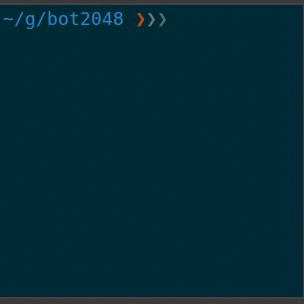

# Bot 2048

Bot 2048 is an artificial player of the game 2048: [here](https://play2048.co/).

A detailed artcile is available [here](http://thomas-joly.com/).



## Build

```sh
$ make
▶ generate bot/path.go
▶ generate bot/transformation.go
▶ build /home/thomas/git/bot2048/bot2048
```

## Run the test

```sh
$ make test
▶ test
?   	github.com/lunatikub/bot2048	[no test files]
=== RUN   TestSetGetTile
--- PASS: TestSetGetTile (0.00s)
=== RUN   TestSetGetLine
--- PASS: TestSetGetLine (0.00s)
=== RUN   TestSetGetCol
--- PASS: TestSetGetCol (0.00s)
=== RUN   TestMoveLeft
--- PASS: TestMoveLeft (0.00s)
=== RUN   TestMoveRight
--- PASS: TestMoveRight (0.00s)
=== RUN   TestMoveUp
--- PASS: TestMoveUp (0.00s)
=== RUN   TestMoveDown
--- PASS: TestMoveDown (0.00s)
PASS
ok  	github.com/lunatikub/bot2048/bot	0.006s
```

## Usage

```sh
$ ./bot2048 --help
Usage of ./bot2048:
  -depth int
    	depth of the algorithm (default 3)
  -log string
    	log file
  -pretty
    	dump the doard with ncurses
```

